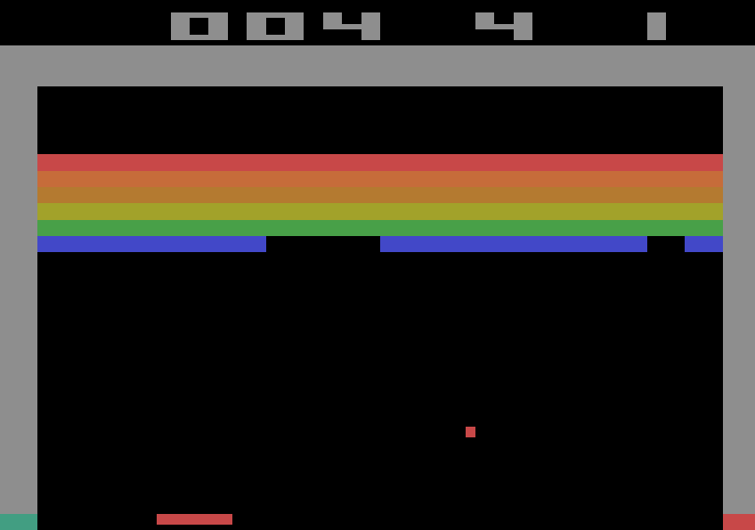

# Customized_Breakout-v4

This reinforcement learning project involved developing agents to play the Breakout-v4 game from OpenAI Gym, implementing both traditional Q-learning and Deep Q-Learning algorithms. The focus was on evaluating the effectiveness of these approaches in environments with action uncertainty, where the agent's actions may not always be executed as intended. The Deep Q-Learning implementation was enhanced with Convolutional Neural Networks (CNNs) to process high-dimensional game inputs, enabling the agent to learn more complex strategies and improve its performance. The results demonstrated that the CNN-enhanced Deep Q-Learning model significantly outperformed the traditional Q-learning approach in terms of stability and adaptability. Additionally, the project highlighted the substantial impact of action uncertainty in noisy environments, revealing that varying levels of noise can greatly affect the training outcomes of Deep Q-Learning agents. 
